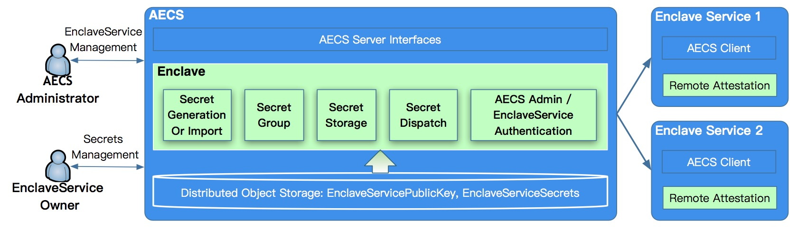

# AECS

Attestation based Enclave Configuration Service


## 1 Introduction to KubeTEE AECS

KubeTEE AECS provides the secret generation, management, storage and dispatch
service to TEE applications. After bidirectional authentication based on
remote attestation between AECS and all TEE-based application service,
each service enclave instance will share the secrets from AECS server,
and use the secrets for later use cases.



As far as now, we support the following type of secrets:

- AES-GCM 256 key
- RSA key pair
- SM2 key pair
- Self-signed certificate and key
- Secret imported by user (Bring your own seret)
- Application sensitive configurations as key-value pair


## 2 Quick Start


### 2.1 Run prebuild AECS server for test only

We provide a public docker image for AECS server test only. It's runing in
simulation mode and also has debug log messages. Try it simply like this:

```
./deployment/start.sh start  # stop command to stop it
```


### 2.2 Build the test AECS server from source code

In case you want to build the AECS and create the docker image by your self,
please follow the steps (2.2.1 ~ 2.2.4) below.


#### 2.2.1 Update sub-modules

If it's the first time you build the project after clone the source code,
please update the sub-modules like the this.

```
git submodule update --init --recursive
```


#### 2.2.2 Build Project in Docker Environment

```
./deployment/dockerbuild.sh [--build Debug]
```


#### 2.2.3 Create the Docker Image

You need to generate the test certificates like this (for development and test only, should use formal certificates in product environment):

```
./deployment/generate_certs_and_kubeconfig.sh
```

Then create the image with test certificates and configurations.

```
./deployment/create_image.sh
```

#### 2.2.4 Start the AECS server

```
./deployment/run_image.sh ./aecs_server
```

### 2.3 Manage the Enclave Service

```
# Save the AECS identity key into storage for backup for the first time to start the aecs server
# For the second time start the aecs server, this provision action will reload the identity key.
./deployment/run_image.sh ./aecsadmin --config /etc/kubetee/aecs_admin_test.kubeconfig --action provision --hostname localtest

# Create a enclave service named "service1" and list it
./deployment/run_image.sh ./aecsadmin --config /etc/kubetee/aecs_admin_test.kubeconfig --action register --service service1 --pubkey /etc/certs/service_admin_public.pem
./deployment/run_image.sh ./aecsadmin --config /etc/kubetee/aecs_admin_test.kubeconfig --action list
```

### 2.4 Manage the Enclave Service Secrets

```
# Create three test secrets for service1 and list all of them
./deployment/run_image.sh ./serviceadmin --config /etc/kubetee/service_admin_test.kubeconfig --action create --policy /etc/kubetee/service_secret_policy.yaml
./deployment/run_image.sh ./serviceadmin --config /etc/kubetee/service_admin_test.kubeconfig --action list
```

## 3 Contributing

KubeTEE AECS is not final stable at this moment. There will be some improvements or new feature updates later.
Anyone is also welcome to provide any form of contribution, please see CONTRIBUTING.md for details.

For any security vulnerabilities or other problems, please contact us by [email](mailto:SOFAEnclaveSecurity@list.alibaba-inc.com).


## 4 License
KubeTEE AECS is released by Ant Group under Apache 2.0 License and also used some other opensource code.
See the license information [here](LICENSE) for detail.
